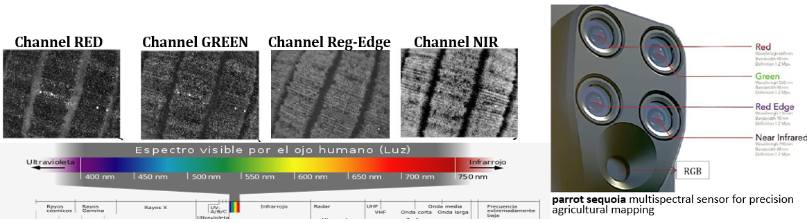
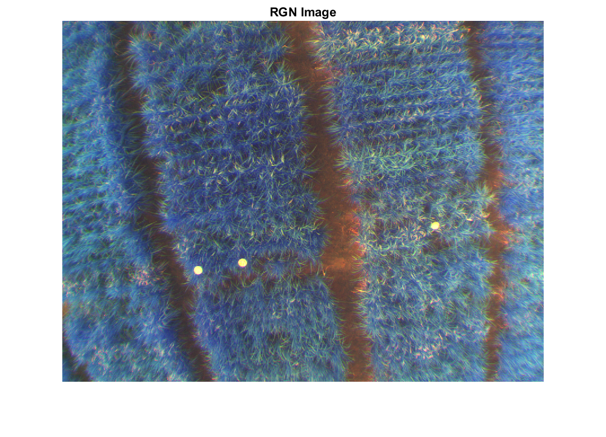
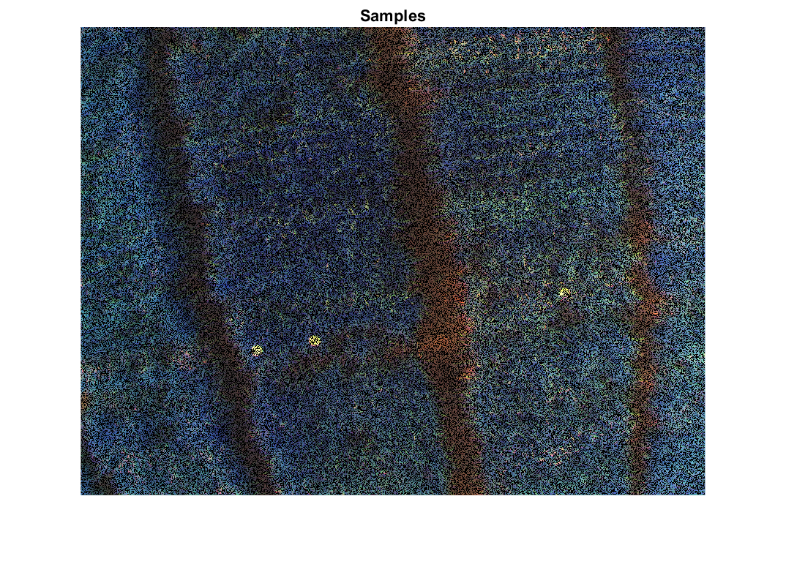
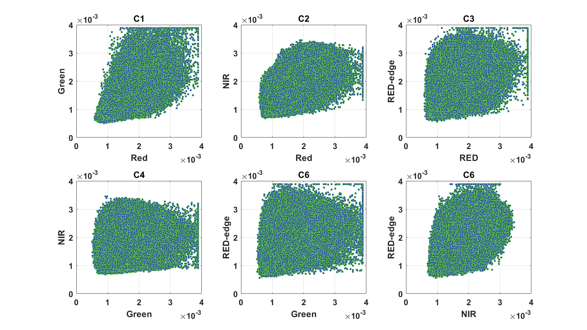

# **"GFKuts" Hyperspectral image segmentation**

  

This guide has been developed with images captured with the remote sensing camera **parrot sequoia**. The **RGN image** represents the reconstruction of a multispectral image

  

---
This project was written in MatLab softwar. To run it: **open PX.m**

    if you want to use another image change the reference in section:
    **"% Read Dataset Chanel R-G-Re-N-RGB"**
    
    Run "PX.m"
    
    
---

  

  

